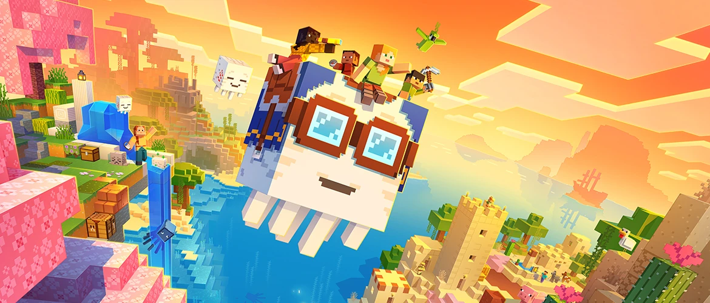

# 3D Specimen Display Demo



[]()
[]()
[]()
[]()

A lightweight, fully responsive frontend demo designed to elegantly display 3D scanned models. This project utilizes a retro, Minecraft-inspired GUI aesthetic combined with modern WebGL rendering to create an interactive gallery experience.

🔗 **Live Demo:** [Explore the Specimen Here](https://xxxstars0.github.io/3D-Scanning-Display-Demo/)

## ✨ Highlights

* **Interactive 3D Preview & Hotspots:** Utilizes Google's `<model-viewer>` component for native, high-performance `.glb` rendering. Features clickable 3D hotspots that dynamically guide the camera and trigger AI explanations.
* **Decoupled Configuration:** Text, image paths, and model URLs are completely separated from the code via a `data.json` configuration file, making updates effortless.
* **Photo Gallery:** A scrollable, responsive grid to display an arbitrary number of specimen photos. Hovering over a thumbnail reveals a Minecraft-style tooltip description, and clicking opens a high-res modal overlay.
* **Minecraft GUI Aesthetic:** Custom styled UI with authentic pixel fonts and embossed panels mimicking classic gaming interfaces.
* **Lightweight & Vanilla:** Built with pure HTML, CSS, and JavaScript without any heavy frameworks, allowing for instant loading and simple hosting.

## 🛠️ Production Workflow

The digital assets used in this demo were created using the following workflow:

1. **Scanning:** The 3D models were scanned and processed using the [Apple Reality Composer](https://apps.apple.com/us/app/reality-composer/id1462358802) app on iOS.
2. **Rendering & Processing:** The 6-sided orthographic screenshots with transparent backgrounds were generated using Unity.

## 🚀 Performance Optimization

To ensure fast load times and a smooth user experience, the 3D models have been heavily optimized:

* **Dual Compression Strategy:** The 3D model uses both **Draco compression** (for geometry/meshes) and **WebP compression** (for embedded textures) using the `@gltf-transform/cli` tool.
* **Massive Size Reduction:** The final model size was reduced by over **96%** (from 13.8 MB down to 532 KB) while remaining visually lossless.
* *Note: The original uncompressed model (`Happy Ghast in a Box_9746.glb`) is kept in the `models/` directory strictly as a high-fidelity reference for future edits.*

## ⚙️ Usage & Configuration

Because this project dynamically loads local JSON data and 3D models, it must be run through a local web server to bypass browser CORS security restrictions.

### How to Run Locally

1. Clone this repository:
   ```bash
   git clone https://github.com/XXXStars0/3D-Scanning-Display-Demo.git
   ```
   (Or download the ZIP archive from the GitHub project page).
2. Serve the root directory using any local web server. For example:
   * **Python:** Run `python -m http.server` (or `python3`) in the terminal and visit `http://localhost:8000`.
   * **VS Code:** Install the "Live Server" extension, right-click `index.html`, and select "Open with Live Server".
   * **Node.js:** Run `npx serve .`

### How to Configure Content

You do not need to modify any HTML or JS files to change the displayed content. The configuration has been split into four specialized files for high readability and modularity:

1. **`data/content.json`**:
   The primary file for the 3D specimen. Contains the title, description, model paths, image gallery array, and 3D hotspots.

2. **`data/ui_text.json`**:
   Contains all hardcoded UI strings (buttons, loading texts, tooltips). Perfect for localizing the website to another language without touching code.

3. **`data/ai_config.json`**:
   The brain settings for the AI Guide. Contains the AI welcome message, custom system prompt additions, and generic `[ACTION: id]` mappings for camera control.

4. **`data/theme.json`** (New!):
   The central theme engine configuration. It allows for global style switching (e.g., between a Minecraft pixel aesthetic and a modern Cornell academic aesthetic) simply by changing the `activeTheme` key.

### 🎨 Theme Engine

The project now supports a fully decoupled **Theme Engine**. 
To switch the visual style of the entire website, open `data/theme.json`:

```json
{
  "activeTheme": "cornell", // Change this to "minecraft" to instantly switch themes
  "themes": {
    "cornell": {
      "name": "cornell",
      "chatIcon": "💬",
      "colors": { ... },
      "fonts": { ... }
    },
    "minecraft": { ... }
  }
}
```

*Note: The `theme` block dynamically overrides CSS variables, fonts (Google Fonts or local `.ttf`), and structural CSS classes without requiring you to touch `style.css`! The Cornell theme introduces a clean, academic layout with modern dialog bubbles, while the Minecraft theme offers a retro gaming UI.*

## 🤖 AI Guide Integration (Pure Frontend)

This project features a fully client-side AI integration allowing users to chat with an intelligent "Museum Guide".
* **User-Configurable API:** Because this is a static site, users must provide their own OpenAI-compatible API credentials via the "⚙ AI Settings" button.
* **Security & Fallback:** API credentials are saved securely in `localStorage`. For local development, simply create a `.env` file (e.g. `API_KEY=sk-xxx`, `API_MODEL=deepseek-v4-flash`). It's ignored by Git and will be auto-loaded securely.

### 📚 Dynamic Knowledge Base
The AI does not hallucinate facts. It acts as an expert museum guide by loading context directly from `data/knowledge.md`. 
To teach the AI new facts or change its persona:
1. Open `data/knowledge.md`.
2. Edit the markdown file with any new facts, dimensions, lore, or rules.
3. The Chat UI will automatically parse this and inject it into the system prompt.

*Note: Future optimizations may include advanced chunking and RAG (Retrieval-Augmented Generation) if the knowledge base outgrows the current system prompt injection approach.*

### 🎯 Deep 3D & AI Integration
The AI guide is deeply integrated with the 3D viewer:
1. **Hotspot Triggers:** Clicking a golden hotspot on the 3D model automatically rotates the camera to that feature and asks the AI guide to explain it.
2. **AI Camera Control:** The AI can actively take control of the 3D camera! If the AI wants to show you something, it emits a hidden `[LOOKAT: ...]` command in its response to dynamically spin the 3D model to the exact coordinate it is discussing.

### 📍 Developer Mode: Hotspot Coordinate Picker
To make adding new hotspots incredibly easy without guessing complex 3D coordinates:
1. Ensure `const DEBUG_MODE = true;` is set in `js/script.js`.
2. Open the page and hold the **`Alt`** key while clicking anywhere on the 3D model.
3. An exact JSON snippet with the calculated 3D `position` and `normal` vectors will be generated and printed to your browser's Developer Console (F12), ready to be pasted directly into `data/content.json`!

## 🌐 Deployment (GitHub Pages)

This project is deployed and hosted for free via **GitHub Pages**. 

The live site is automatically built and updated from the `main` branch: [https://xxxstars0.github.io/3D-Scanning-Display-Demo/](https://xxxstars0.github.io/3D-Scanning-Display-Demo/)

## 📝 Future Roadmap & Planned Features

*   **Dynamic Multi-Specimen Support:** Refactor the codebase to support multiple items using a central config routing system (e.g., via URL parameters).
*   **Knowledge Base Expansion:** Implement advanced RAG (Retrieval-Augmented Generation) if the `knowledge.md` file grows too large for standard system prompts.